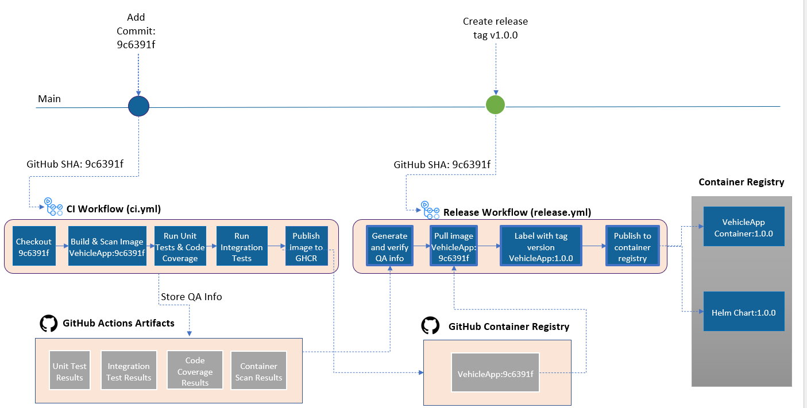

# VehicleApp build and release process

## Overview
The release of a VehicleApp through the GitHub actions workflows provided by the VehicleApp template repositories (ci.yml, release.yml) is a two-step process:

- **Build**
  - The VehicleApp container image is built by the `CI workflow` for every new commit on the `main` branch.
  - The container image is labeled with the commit hash and uploaded to the GitHub Container Registry.
  - Surrounding QA info like unit and integration tests results, code coverage results, container scan results etc. are saved to GitHub artifacts.
- **Release**
  - Prerequisite: `CI workflow` has been run successfully  for the current commit on the main branch.
  - If the `main` branch is ready for release, the VehicleApp developer creates a new GitHub release manually through the GitHub UI.
  - GitHub automatically creates a Git tag for the new release with the specified version and triggers the `Release workflow`.
  - The `Release workflow` loads the QA info from GitHub artifacts with the same commit. If there is no info available for the current commit, the release workflow will fail, otherwise the QA info is verified, release documentation is generated and added to the GitHub release.
  - Finally, the `Release workflow` pulls the VehicleApp container image based on the current commit hash from the GitHub registry. If the image cannot be found, e.g. because the CI workflow has not built it, the workflow will fail. If the image can be pulled, it is labeled with the specified tag version and uploaded to the OTA system.

## GitHub artifacts and container registry
As described in the overview section, GitHub artifacts and the GitHub container registry are used for storing data, which is generated by the `CI workflow` and leveraged by the `Release workflow`.

**GitHub Actions artifacts** always have a retention period, which is 90 days per default, but may be configured differently in the specific GitHub organization. After this period, the QA info gets purged automatically. If that is the case, a re-run of the CI workflow is required to re-generate the QA info, afterwards a release can be created.

The **GitHub container registry** does not have an automatic cleanup and keeps container images as long as they are not deleted. It is recommended to automate removal of older images to limit storage size and costs.

## Versioning
VehicleApp image versions are set to the Git tag name during release.

Though any versioning scheme can be adoped, the usage of [semantic versions](https://semver.org/) is recommended.

If the tag name contains a semantic version, leading `v` will be trimmed.

**Example:** A tag name of `v1.0.0` will lead to version `1.0.0` of the VehicleApp container.

## Maintaining multiple versions
If there is a need to maintain multiple versions of a VehicleApp, e.g. to hotfix the production version while in parallel working on a new version or to support multiple versions in production, create and use `release branches`.

The release process would be the same as described in the overview, except that before the release step a release branch (e.g. `release/v1.0`) is created and the GitHub release is based on the `release` branch rather than the `main` branch. For hotfixes, release branches may be created retroactively from the release tag if needed.
